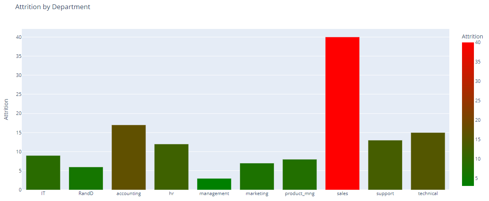
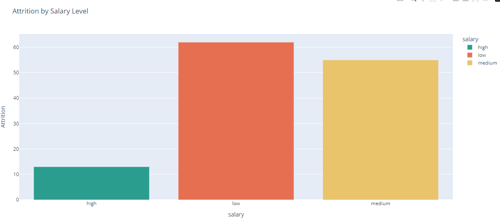
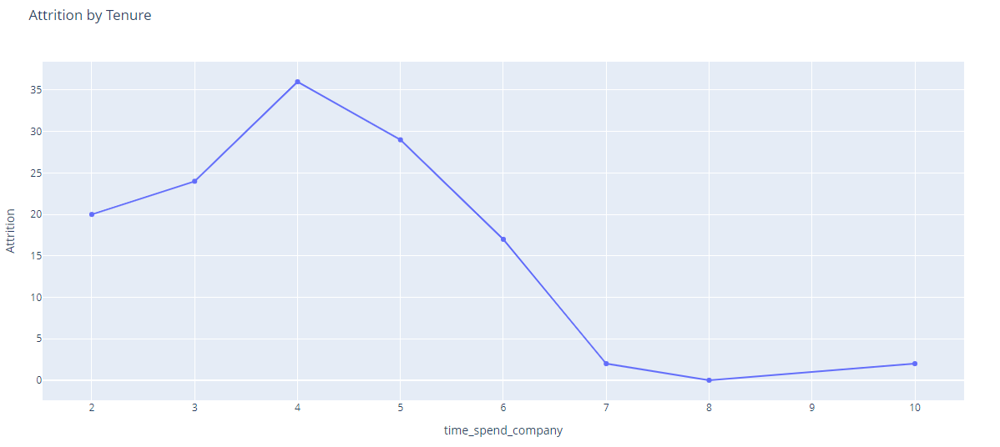
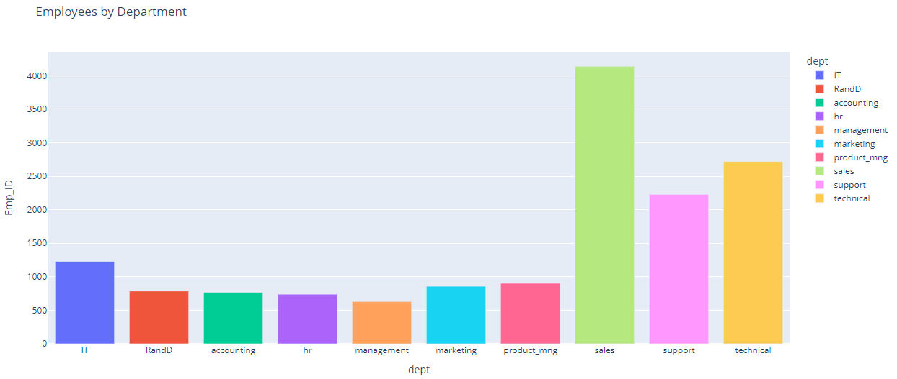
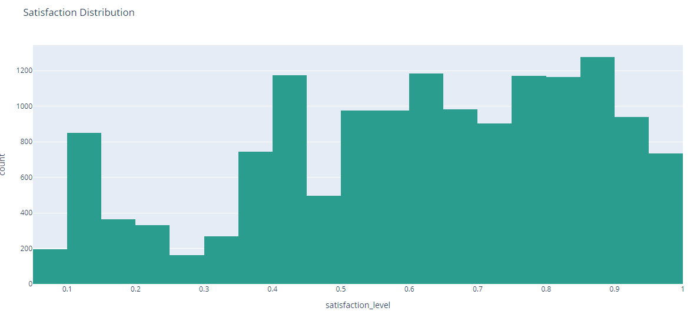
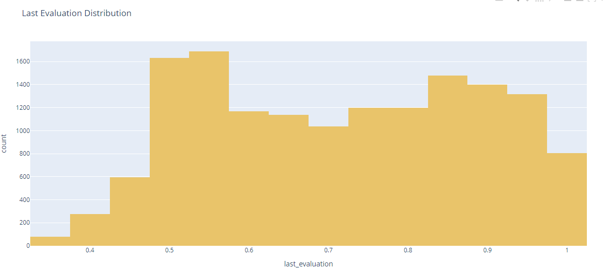
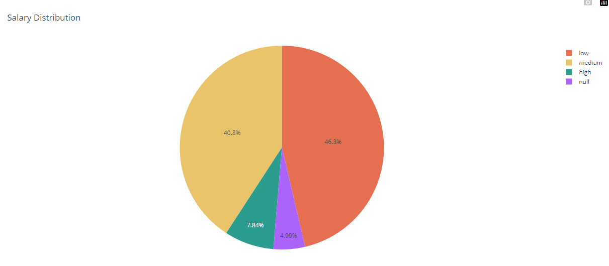
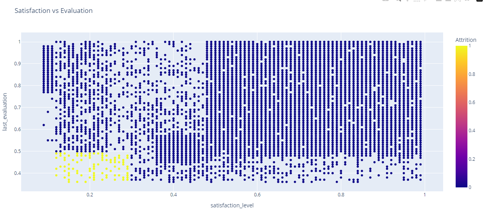
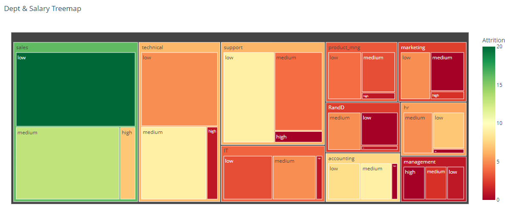
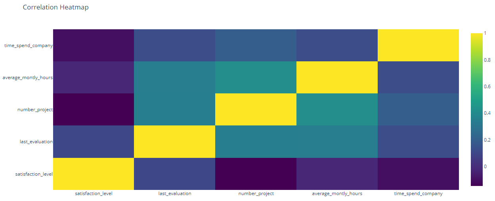

# 📊 Employee Attrition Dashboard

## 📖 Project Overview
This project provides a **comprehensive analysis** of employee data across multiple departments.  
It combines **SQL queries, Python data analysis, visualization**, and **Power BI dashboards** to extract actionable insights on:

- Employee satisfaction and performance
- Attrition patterns across departments, salary levels, and tenure
- Workload distribution and department overview
- Relationships between salary, promotion, and employee retention

> ⚠️ Note: A **Power BI dashboard** is available for interactive exploration. Screenshots of the charts are provided in the `visuals/` folder.

---

## 🗂️ Project Structure

Employee_Attrition_Dashboard/
│
├── data/ # Raw datasets (CSV/SQL Server export)
├── sql_queries/ # SQL scripts for data extraction
├── python_scripts/ # Python analysis scripts (plotly & pandas)
├── visuals/ # Main visualizations used in the dashboard
├── visuals_extra/ # Additional exploratory charts
├── PowerBI/ # Power BI dashboard file
└── README.md # Project documentation

---

## 🚀 Getting Started

### Requirements
- Python 3.8+
- Libraries: `pandas`, `plotly`, `numpy`, `matplotlib`, `seaborn`
- SQL Server (for running queries)
- Power BI Desktop (free version supported)

### Usage

1. **SQL Queries**
   - Run SQL scripts from `sql_queries/` to extract employee data.  
   - Main table: `Employee` in database `Employee_Accidents`.

2. **Python Scripts**
   - `data_analysis.py` → Clean, process, and visualize data.  
   - Generates interactive charts in HTML and saves screenshots to `visuals/`.

3. **Power BI Dashboard**
   - Open `.pbix` file from `PowerBI/` to explore interactive charts and KPIs.

---

## 📊 Visualizations

### Main Charts

#### 1.Total Employees, Avg Satisfaction & Evaluation
Cards display total workforce, average satisfaction, and performance evaluation scores.

#### 2.Attrition by Department

#### 3.Attrition by Salary Level

#### 4.Attrition by Tenure

#### 5.Employees by Department

#### 6.Satisfaction Distribution

#### 7.Last Evaluation Distribution

#### 8.Salary Distribution

#### 9.Satisfaction vs Evaluation

#### 10.Dept & Salary Treemap

### 11.Correlation Heatmap**  

---

## 📌 Key Findings & Recommendations

### Key Findings
- Attrition is highest in Sales and among low-salary employees.  
- Employees with high evaluation but low satisfaction may indicate burnout risks.  
- Workload imbalances exist across departments.  
- Promotion and career growth opportunities correlate with higher retention.  

### Recommendations
- Focus retention strategies on high-risk departments and low-salary roles.  
- Monitor workload and adjust project assignments to reduce burnout.  
- Offer career development programs and timely promotions.  
- Use interactive dashboards to track attrition trends and employee satisfaction over time.

---

## 🖥️ Next Steps
- Enhance Power BI dashboards with advanced filtering and interactive features.  
- Apply predictive analytics for employee attrition forecasting.  
- Monitor trends regularly and update dashboards monthly.

---

## 🏷️ Author
**Prepared by:**  
**Mohamed Emad Alhadi – Data Analyst**  
**Date:** September 2025  
